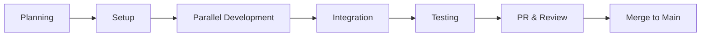

# Stockle 開発プロセス詳細

## 🎯 開発の全体像

4人チーム（PdM + Member 3名）での2週間スプリント制開発プロセス



## 📅 開発サイクル（2週間スプリント）

### Week 1: 開発フェーズ
- **月〜水**: 各メンバーが機能開発
- **木〜金**: 初期統合とフィードバック

### Week 2: 統合・完成フェーズ  
- **月〜火**: 最終実装と修正
- **水〜木**: 統合テストとバグ修正
- **金**: PR作成とレビュー

## 🚀 詳細な開発プロセス

### 1️⃣ 初期セットアップ（Day 1）

#### 全メンバー共通作業
```bash
# リポジトリのクローン（初回のみ）
git clone https://github.com/your-org/Stockle.git
cd Stockle

# 最新のmainブランチを取得
git checkout main
git pull origin main

# 環境変数の設定
cp .env.example .env
# .envファイルを編集

# フェーズを設定
export PHASE="phase1"  # 現在のフェーズを設定
```

#### 役割別Worktree作成

**PdM（統合管理者）**
```bash
git worktree add -b feature/${PHASE}-integration worktree-integration
cd worktree-integration
# 統合環境のセットアップ
docker-compose up -d
```

**Member 1（フロントエンド）**
```bash
git worktree add -b feature/${PHASE}-frontend worktree-frontend
cd worktree-frontend/frontend
npm install
npm run dev
```

**Member 2（バックエンド基盤）**
```bash
git worktree add -b feature/${PHASE}-backend-infrastructure worktree-backend-infrastructure
cd worktree-backend-infrastructure/backend
go mod download
make setup-db
air
```

**Member 3（バックエンド機能）**
```bash
git worktree add -b feature/${PHASE}-backend-features worktree-backend-features
cd worktree-backend-features/backend
go mod download
# AI APIキーの設定
echo "GROQ_API_KEY=your-key" >> ../.env
```

### 2️⃣ 並列開発フェーズ（Day 2-8）

#### 日次ルーティン

**朝の同期（9:00）**
```bash
# 各自のworktreeで
git fetch origin
git rebase origin/main

# 進捗共有（仮想スタンドアップ）
# - 昨日の完了タスク
# - 今日の予定タスク
# - ブロッカー共有
```

**開発作業**
```bash
# 機能実装
# 例: Member 1
cd worktree-frontend
npm run dev

# テスト駆動開発
npm run test:watch

# 定期的なコミット（1-2時間ごと）
git add .
git commit -m "feat(frontend): ユーザー認証フォームの実装"
```

**夕方のプッシュ（18:00）**
```bash
# その日の作業をリモートにプッシュ
git push origin feature/${PHASE}-frontend

# 簡易PR作成（レビュー用）
gh pr create --draft --title "WIP: フロントエンド実装" --body "本日の進捗"
```

### 3️⃣ 統合フェーズ（Day 9-10）

#### PdMによる統合作業
<<<<<<< HEAD
```bash
cd worktree-integration

# 各メンバーのブランチを統合
git merge origin/feature/${PHASE}-frontend --no-ff
git merge origin/feature/${PHASE}-backend-infrastructure --no-ff
git merge origin/feature/${PHASE}-backend-features --no-ff

# 統合テスト実施
docker-compose up -d
npm run test:integration
=======

```bash
cd worktree-integration

# Step 1: 最新のmainを取得
git fetch origin
git rebase origin/main

# Step 2: 各メンバーのブランチを統合
# フロントエンド統合
git fetch origin feature/phase1-frontend
git merge origin/feature/phase1-frontend --no-ff -m "feat: フロントエンド実装を統合

- 認証UI実装完了
- 記事管理画面実装完了
- レスポンシブ対応完了"

# バックエンド基盤統合
git fetch origin feature/phase1-backend-infra
git merge origin/feature/phase1-backend-infra --no-ff -m "feat: バックエンド基盤を統合

- Go + Gin基盤構築完了
- 認証システム実装完了
- データベース設計実装完了"

# バックエンド機能統合
git fetch origin feature/phase1-backend-features
git merge origin/feature/phase1-backend-features --no-ff -m "feat: バックエンド機能を統合

- AI統合実装完了
- 要約生成機能実装完了
- 非同期処理実装完了"
```

#### 統合テスト実施

```bash
# 全体環境の起動
docker-compose down
docker-compose up -d

# データベースマイグレーション
cd backend
make migrate-up

# 統合テスト実行
cd ..
npm run test:integration

# E2Eテスト実行
cd frontend
npm run test:e2e

# 負荷テスト
cd ../backend
go test -bench=. ./...
```

### 4️⃣ 品質保証フェーズ（Day 11-12）

#### コード品質チェック

```bash
# フロントエンド
cd frontend
npm run lint
npm run type-check
npm run test:coverage

# バックエンド
cd ../backend
go fmt ./...
go vet ./...
golangci-lint run
go test -cover ./...
```

#### セキュリティチェック

```bash
# 依存関係の脆弱性チェック
npm audit
go mod audit

# シークレットのスキャン
gitleaks detect
```

### 5️⃣ PR作成とレビュー（Day 13）

```bash
# 最終PR作成（PdM）
gh pr create \
  --base main \
  --head feature/${PHASE}-integration \
  --title "feat: ${PHASE} 実装完了"
```

## 📊 進捗管理

### 日次進捗レポート
```markdown
## 📅 進捗レポート

### ✅ 完了タスク
- [Frontend] 認証フォームUI実装
- [Backend] JWT認証エンドポイント実装
- [AI] Groq API接続テスト

### 🚧 進行中タスク
- [Frontend] 記事一覧画面
- [Backend] 記事保存API
- [AI] 要約生成ロジック

### 🚨 ブロッカー
- なし

### 📊 進捗率: 45%
```

## 🛡️ リスク管理
| リスク | 影響度 | 対策 |
|--------|--------|------|
| API統合の遅延 | 高 | モックAPI先行実装 |
| パフォーマンス問題 | 中 | 早期負荷テスト |
| 統合時のコンフリクト | 中 | 小刻みな統合 |

## 🎉 成功のポイント

1. **早期統合・頻繁な統合** - 週2回の統合でリスクを最小化
2. **明確な責任分担** - 各メンバーの担当範囲を明確化  
3. **自動化の徹底** - テスト、ビルド、デプロイの自動化
4. **品質への妥協なし** - テストカバレッジ80%以上を維持

---

このプロセスに従うことで、4人チームでの効率的かつ高品質な開発を実現します。