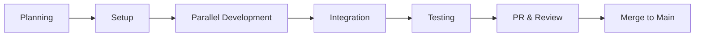

# Stockle 開発プロセス詳細

## 🎯 開発の全体像



## 📅 開発サイクル（2週間スプリント）

### Week 1: 開発フェーズ
- **月〜水**: 各メンバーが機能開発
- **木〜金**: 初期統合とフィードバック

### Week 2: 統合・完成フェーズ  
- **月〜火**: 最終実装と修正
- **水〜木**: 統合テストとバグ修正
- **金**: PR作成とレビュー

## 🚀 詳細な開発プロセス

### 1️⃣ 初期セットアップ（Day 1）

#### 全メンバー共通作業
```bash
# リポジトリのクローン（初回のみ）
git clone https://github.com/your-org/Stockle.git
cd Stockle

# 最新のmainブランチを取得
git checkout main
git pull origin main

# 環境変数の設定
cp .env.example .env
# .envファイルを編集
```

#### 役割別Worktree作成

**PdM（統合管理者）**
```bash
git worktree add -b feature/phase1-integration worktree-integration
cd worktree-integration
# 統合環境のセットアップ
docker-compose up -d
```

**Member 1（フロントエンド）**
```bash
git worktree add -b feature/phase1-frontend worktree-frontend
cd worktree-frontend/frontend
npm install
npm run dev
```

**Member 2（バックエンド基盤）**
```bash
git worktree add -b feature/phase1-backend-infra worktree-backend-infra
cd worktree-backend-infra/backend
go mod download
make setup-db
air
```

**Member 3（バックエンド機能）**
```bash
git worktree add -b feature/phase1-backend-features worktree-backend-features
cd worktree-backend-features/backend
go mod download
# AI APIキーの設定
echo "GROQ_API_KEY=your-key" >> ../.env
```

### 2️⃣ 並列開発フェーズ（Day 2-8）

#### 日次ルーティン

**朝の同期（9:00）**
```bash
# 各自のworktreeで
git fetch origin
git rebase origin/main

# 進捗共有（仮想スタンドアップ）
# - 昨日の完了タスク
# - 今日の予定タスク
# - ブロッカー共有
```

**開発作業**
```bash
# 機能実装
# 例: Member 1
cd worktree-frontend
npm run dev

# テスト駆動開発
npm run test:watch

# 定期的なコミット（1-2時間ごと）
git add .
git commit -m "feat(frontend): ユーザー認証フォームの実装"
```

**夕方のプッシュ（18:00）**
```bash
# その日の作業をリモートにプッシュ
git push origin feature/phase1-frontend

# 簡易PR作成（レビュー用）
gh pr create --draft --title "WIP: フロントエンド実装" --body "本日の進捗"
```

### 3️⃣ 統合フェーズ（Day 9-10）

#### PdMによる統合作業

```bash
cd worktree-integration

# Step 1: 最新のmainを取得
git fetch origin
git rebase origin/main

# Step 2: 各メンバーのブランチを統合
# フロントエンド統合
git fetch origin feature/phase1-frontend
git merge origin/feature/phase1-frontend --no-ff -m "feat: フロントエンド実装を統合

- 認証UI実装完了
- 記事管理画面実装完了
- レスポンシブ対応完了"

# バックエンド基盤統合
git fetch origin feature/phase1-backend-infra
git merge origin/feature/phase1-backend-infra --no-ff -m "feat: バックエンド基盤を統合

- Go + Gin基盤構築完了
- 認証システム実装完了
- データベース設計実装完了"

# バックエンド機能統合
git fetch origin feature/phase1-backend-features
git merge origin/feature/phase1-backend-features --no-ff -m "feat: バックエンド機能を統合

- AI統合実装完了
- 要約生成機能実装完了
- 非同期処理実装完了"
```

#### 統合テスト実施

```bash
# 全体環境の起動
docker-compose down
docker-compose up -d

# データベースマイグレーション
cd backend
make migrate-up

# 統合テスト実行
cd ..
npm run test:integration

# E2Eテスト実行
cd frontend
npm run test:e2e

# 負荷テスト
cd ../backend
go test -bench=. ./...
```

### 4️⃣ 品質保証フェーズ（Day 11-12）

#### コード品質チェック

```bash
# フロントエンド
cd frontend
npm run lint
npm run type-check
npm run test:coverage

# バックエンド
cd ../backend
go fmt ./...
go vet ./...
golangci-lint run
go test -cover ./...
```

#### セキュリティチェック

```bash
# 依存関係の脆弱性チェック
npm audit
go mod audit

# シークレットのスキャン
gitleaks detect
```

### 5️⃣ PR作成とレビュー（Day 13）

#### 最終PR作成（PdM）

```bash
# 統合ブランチをプッシュ
git push origin feature/phase1-integration

# PR作成
gh pr create \
  --base main \
  --head feature/phase1-integration \
  --title "feat: Phase 1 MVP実装完了" \
  --body "$(cat <<'EOF'
## 🎯 概要
Phase 1のMVP実装を完了しました。

## ✨ 実装機能

### フロントエンド
- ✅ Next.js 14 + TypeScript基盤構築
- ✅ 認証UI（NextAuth.js + Google OAuth）
- ✅ 記事管理UI（保存・一覧・検索）
- ✅ レスポンシブデザイン対応

### バックエンド基盤
- ✅ Go + Gin + GORM基盤構築
- ✅ JWT認証システム
- ✅ 記事管理REST API
- ✅ Webスクレイピング機能

### バックエンド機能
- ✅ Groq/Claude API統合
- ✅ AI要約生成機能
- ✅ 非同期ジョブ処理

## 📊 テスト結果
- 単体テスト: 245/245 ✅ (カバレッジ: 82%)
- 統合テスト: 38/38 ✅
- E2Eテスト: 15/15 ✅
- パフォーマンステスト: API応答 < 200ms ✅

## 🔒 セキュリティ
- 脆弱性スキャン: 0 issues
- OWASP Top 10対策: 実装済み

## 📋 チェックリスト
- [x] 全機能の実装完了
- [x] テスト合格
- [x] ドキュメント更新
- [x] セキュリティレビュー
- [x] パフォーマンス要件達成

## 👥 Contributors
- @pdm: 統合・プロジェクト管理
- @member1: フロントエンド実装
- @member2: バックエンド基盤実装
- @member3: AI機能実装

🤖 Generated with Claude Code
EOF
)"
```

#### レビュープロセス

1. **自動チェック**
   - CI/CDパイプラインの確認
   - テスト結果の確認
   - コードカバレッジの確認

2. **相互レビュー**
   - 各メンバーが他メンバーの実装をレビュー
   - セキュリティ観点でのレビュー
   - パフォーマンス観点でのレビュー

3. **最終承認**
   - 全てのチェックが完了
   - 2名以上の承認を取得

### 6️⃣ マージとリリース（Day 14）

```bash
# PRのマージ（GitHubのUIまたはCLI）
gh pr merge --squash --delete-branch

# タグ付けとリリース
git checkout main
git pull origin main
git tag -a v1.0.0 -m "Phase 1 MVP Release"
git push origin v1.0.0

# リリースノート作成
gh release create v1.0.0 \
  --title "Phase 1 MVP Release" \
  --notes "Phase 1の全機能を実装しました。詳細はPR #XXを参照してください。"
```

## 📈 進捗管理ツール

### GitHubプロジェクトボード
```
TODO | IN PROGRESS | REVIEW | DONE
-----|-------------|--------|------
```

### 日次進捗レポート（Slack/Discord）
```markdown
## 📅 2024/01/15 進捗レポート

### ✅ 完了タスク
- [Frontend] 認証フォームUI実装
- [Backend] JWT認証エンドポイント実装
- [AI] Groq API接続テスト

### 🚧 進行中タスク
- [Frontend] 記事一覧画面
- [Backend] 記事保存API
- [AI] 要約生成ロジック

### 🚨 ブロッカー
- なし

### 📊 進捗率: 45%
```

## 🛡️ リスク管理

### 技術的リスク
| リスク | 影響度 | 対策 |
|--------|--------|------|
| API統合の遅延 | 高 | モックAPI先行実装 |
| パフォーマンス問題 | 中 | 早期負荷テスト |
| 依存関係の競合 | 低 | Docker環境統一 |

### プロセスリスク
| リスク | 影響度 | 対策 |
|--------|--------|------|
| コミュニケーション不足 | 高 | 日次同期徹底 |
| 統合時のコンフリクト | 中 | 小刻みな統合 |
| スケジュール遅延 | 中 | バッファ時間確保 |

## 🎉 成功のポイント

1. **早期統合・頻繁な統合**
   - 週2回の統合でリスクを最小化

2. **明確な責任分担**
   - 各メンバーの担当範囲を明確化

3. **自動化の徹底**
   - テスト、ビルド、デプロイの自動化

4. **ドキュメント駆動**
   - 実装前に仕様を明文化

5. **品質への妥協なし**
   - テストカバレッジ80%以上を維持

---

このプロセスに従うことで、4人チームでの効率的かつ高品質な開発を実現します。