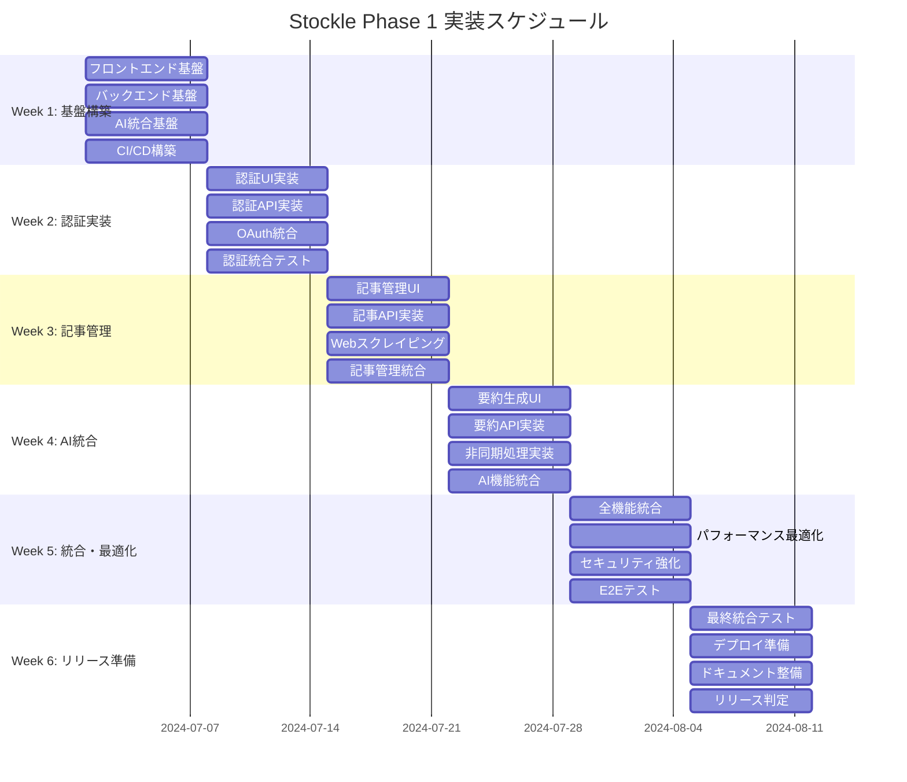

# Stockle 週次スケジュール管理

## 概要
Phase 1実装期間中（Week 1-6）における週次進捗管理とチーム調整のフレームワーク。

## 📅 週次スケジュール概要

### Phase 1 全体スケジュール (6週間)



## 🗓️ 週次管理フレームワーク

### 毎週の定例イベント

#### 月曜日: 週次計画会議
**時間**: 9:00-10:00  
**参加者**: 全チームメンバー  
**アジェンダ**:
- [ ] 前週の成果レビュー
- [ ] 当週の目標設定
- [ ] 依存関係・ブロッカーの確認
- [ ] リソース配分の調整
- [ ] リスク評価・対策検討

#### 水曜日: 中間チェックイン
**時間**: 15:00-15:30  
**参加者**: 全チームメンバー  
**アジェンダ**:
- [ ] 進捗状況の確認
- [ ] ブロッカーの解決支援
- [ ] 相互依存タスクの調整
- [ ] 必要に応じた計画修正

#### 金曜日: 週次振り返り
**時間**: 16:00-17:00  
**参加者**: 全チームメンバー  
**アジェンダ**:
- [ ] 達成度評価
- [ ] 課題・改善点の洗い出し
- [ ] 来週への引き継ぎ事項
- [ ] チーム連携の改善提案

## 📊 週別詳細スケジュール

### Week 1: 基盤構築週

#### 🎯 週次目標
- 全メンバーの開発環境統一
- 基盤コンポーネントの完成
- CI/CDパイプラインの構築

#### 📋 チェックポイント

**Member 1 (Frontend)**
- [ ] Next.js 14 プロジェクト初期化
- [ ] Tailwind CSS + shadcn/ui セットアップ
- [ ] Zustand ストア基本構造作成
- [ ] React Hook Form + Zod 設定
- [ ] 基本レイアウトコンポーネント作成

**Member 2 (Backend Infrastructure)**
- [ ] Go プロジェクト構造作成
- [ ] Gin フレームワーク初期設定
- [ ] GORM + MySQL 接続設定
- [ ] 基本ミドルウェア実装
- [ ] ヘルスチェックエンドポイント作成

**Member 3 (Backend Features)**
- [ ] AI API クライアント実装
- [ ] Groq API 接続確認
- [ ] Claude API フォールバック実装
- [ ] 非同期ジョブキュー基盤作成

**PdM (Project Management)**
- [ ] GitHub Actions CI/CD 設定
- [ ] Docker 開発環境構築
- [ ] API文書テンプレート作成
- [ ] 統合テスト環境準備

#### ⚠️ リスク・対策

| リスク | 影響度 | 対策 |
|--------|--------|------|
| 環境構築での問題 | 高 | 事前検証・ペアプログラミング |
| API仕様の不一致 | 中 | 仕様書の早期作成・共有 |
| パッケージ依存関係の問題 | 中 | Docker化による環境統一 |

### Week 2: 認証統合週

#### 🎯 週次目標
- 認証システムの完全統合
- Google OAuth フローの動作確認

#### 📋 統合テスト項目
- [ ] NextAuth.js + Backend JWT認証の連携
- [ ] Google OAuth フローの動作確認  
- [ ] セッション管理の動作確認
- [ ] 認証ミドルウェアの動作確認
- [ ] エラーハンドリングの確認

#### 🧪 パフォーマンステスト
- [ ] 認証API応答時間 < 200ms
- [ ] 同時認証リクエスト100件テスト
- [ ] セッション有効期限の動作確認

#### 🔒 セキュリティテスト
- [ ] 不正トークンでのアクセス拒否確認
- [ ] CSRF対策の動作確認
- [ ] Rate limiting の動作確認

### Week 3: 記事管理統合週

#### 🎯 週次目標
- 記事保存・一覧・検索機能の統合

#### 📋 統合テスト項目
- [ ] 記事保存フォーム + バックエンドAPI連携
- [ ] Webスクレイピング機能の動作確認
- [ ] 記事一覧表示の動作確認
- [ ] 検索・フィルタリング機能の確認
- [ ] レスポンシブデザインの確認

#### 📊 データ整合性テスト
- [ ] 重複URL保存の防止確認
- [ ] データベーストランザクションの確認
- [ ] エラー時のロールバック確認

### Week 4: AI統合週

#### 🎯 週次目標
- 要約生成機能の完全統合

#### 📋 統合テスト項目
- [ ] 要約生成リクエストの動作確認
- [ ] 非同期処理の動作確認
- [ ] Groq API フォールバック確認
- [ ] 要約結果表示の確認
- [ ] エラーハンドリングの確認

#### ⚡ パフォーマンステスト
- [ ] 要約生成時間の測定
- [ ] 同時要約リクエスト処理確認
- [ ] リソース使用量の監視

### Week 5: 全機能統合週

#### 🎯 週次目標
- 全機能の統合確認
- パフォーマンス最適化

#### 📋 総合テスト項目
- [ ] ユーザー登録からログアウトまでの完全フロー
- [ ] 記事保存から要約表示までの完全フロー
- [ ] 複数ユーザーでの同時利用テスト
- [ ] 長時間稼働テスト
- [ ] 障害復旧テスト

#### 🔧 最適化項目
- [ ] データベースクエリ最適化
- [ ] フロントエンド バンドルサイズ最適化
- [ ] 画像最適化実装
- [ ] キャッシュ戦略実装

### Week 6: リリース準備週

#### 🎯 週次目標
- 本番リリース準備完了

#### 📋 最終チェック項目
- [ ] 全E2Eテストの通過
- [ ] セキュリティ監査の完了
- [ ] パフォーマンス要件の達成確認
- [ ] デプロイメント手順の確認
- [ ] 運用監視設定の完了

#### 📚 ドキュメント整備
- [ ] API仕様書の最終確認
- [ ] 運用マニュアルの作成
- [ ] トラブルシューティングガイド作成
- [ ] リリースノートの作成

## 📈 進捗管理ツール

### 1. 日次進捗トラッキング

#### GitHub Project Board
```markdown
### 進捗ステータス
- **Not Started**: 未着手
- **In Progress**: 実装中
- **Review**: レビュー中
- **Testing**: テスト中
- **Done**: 完了

### ラベル体系
- `P1-frontend`: Member 1担当
- `P1-backend-infra`: Member 2担当  
- `P1-backend-features`: Member 3担当
- `P1-integration`: PdM担当
- `blocker`: ブロッカー
- `dependencies`: 依存関係あり
```

#### 日次スタンドアップ
**フォーマット**:
```markdown
## 昨日やったこと
- 

## 今日やること
- 

## ブロッカー・課題
- 

## 他メンバーへの依頼・連携事項
- 
```

### 2. 週次メトリクス

#### 定量指標
```yaml
metrics:
  completion_rate:
    target: "> 90%"
    measurement: "完了タスク数 / 計画タスク数"
    
  velocity:
    target: "安定"
    measurement: "週間完了ストーリーポイント"
    
  bug_discovery_rate:
    target: "< 5 bugs/week"
    measurement: "新規発見バグ数"
    
  integration_success_rate:
    target: "> 95%"
    measurement: "統合テスト成功率"
```

#### 定性評価
- **チーム連携**: ★★★★☆
- **技術的課題解決**: ★★★★☆  
- **コード品質**: ★★★★☆
- **モチベーション**: ★★★★☆

## 🚨 エスカレーション・意思決定

### ブロッカー解決フロー

#### Level 1: チーム内解決 (24時間以内)
- ペアプログラミング
- 技術調査・検証
- 設計見直し

#### Level 2: PdM判断 (48時間以内)  
- スコープ調整
- 優先順位変更
- リソース再配分

#### Level 3: ステークホルダー判断 (72時間以内)
- スケジュール調整
- 要件変更
- 外部リソース追加

### 意思決定マトリクス

| 決定事項 | 決定者 | 期限 | エスカレーション |
|----------|--------|------|------------------|
| 技術選定変更 | チーム合議 | 24時間 | PdM → CTO |
| API仕様変更 | 関連メンバー | 12時間 | PdM |
| スケジュール調整 | PdM | 48時間 | プロダクトオーナー |
| 要件変更 | プロダクトオーナー | 72時間 | 経営陣 |

## 📋 週次レポートテンプレート

### Week X 進捗レポート

#### 📊 定量実績
```markdown
### 完了率
- 計画タスク: XX件
- 完了タスク: XX件  
- 完了率: XX%

### 品質指標
- バグ発見数: X件
- テスト成功率: XX%
- コードレビュー平均時間: X時間

### パフォーマンス
- 統合テスト実行時間: X分
- デプロイ時間: X分
```

#### 🎯 達成事項
- 

#### ⚠️ 課題・リスク
- 

#### 📅 来週の重点項目
- 

#### 👥 チーム状況
- 

---

**注記**: このスケジュール管理フレームワークは、チームの実際の進捗と課題に応じて柔軟に調整されます。